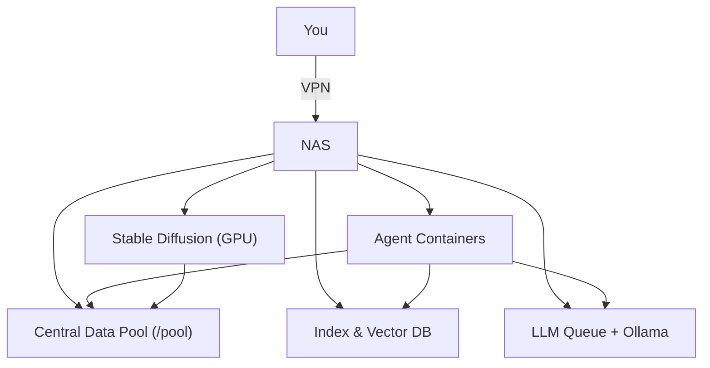

# 🧠📦 Local LLM NAS

> **Pre‑alpha — just getting started.** This repo is the scaffolding for a private, docker‑native AI platform that indexes/searches your knowledge base, runs on‑NAS image generation, and orchestrates a small fleet of agents — all secured behind your VPN.

<p align="center">
  
   
   
   
   
  
</p>

---

## 🚧 Project Status

> **Pre‑alpha / Day‑1 mindset.** This is a new project; expect rapid changes, placeholders, and TODOs.

## ✨ Highlights

* **Total privacy:** Everything runs on your NAS. No cloud round‑trips.
* **Unified data lake:** One central pool mounts into every container for read/write.
* **100% containerized:** Each section/service runs in its own Docker container.
* **Blazing fast search:** RAG pipeline with a vector DB + metadata index across notes, code, PDFs, and binary assets.
* **On‑NAS diffusion:** GPU‑accelerated Stable Diffusion for renders, thumbnails, and concept art.
* **Agent fleet:** 12 purpose‑built agents for documentation, SEO, content outlines, announcement drafting, daily reflection, asset organization, and internal ops.
* **Event‑driven:** Queue + pub/sub glue so agents trigger on commits, new assets, or scheduled cadences.
* **Remote‑ready:** WireGuard/Tailscale‑style VPN access with strict RBAC and API tokens.

---

## 🗺️ System Overview

### Architecture at a glance (plain English)

1. **Your Laptop/PC** connects over **VPN** to the NAS/HomeServer.
2. The **NAS** runs everything in **Docker**: a search/index stack, an LLM queue, lightweight agents, and Stable Diffusion (GPU).
3. A **Central Data Pool** is mounted into each container so every tool sees the same files.
4. You **drop files** in `/pool` → the **Indexer** chunks/embeds them → the **Vector DB** stores them for fast search.
5. You **ask a question** → an **Agent** pulls matching context from the Vector DB → sends a prompt to the **LLM Queue** → gets an answer with citations.

### Simple diagram



---

## 🧩 Components

### Core Services

* **Central Data Pool** (`/pool`): Single source of truth mounted read/write into all containers.
* **Vector DB** (e.g., Qdrant/Milvus/Weaviate): Stores chunk embeddings for fast semantic search.
* **Metadata DB** (PostgreSQL/SQLite): File manifests, versions, tags, audit logs, and job history.
* **Ingest & Indexer:** Watches for changes (inotify/cron), chunks content, normalizes, embeds, and upserts.
* **LLM Task Queue** (custom wrapper around Ollama/HTTP LLMs): Receives requests from agents; routes by model, priority, and SLAs; reports failures via email/webhook.
* **Event Bus** (NATS/Redis Streams): Decouples triggers (git push, new asset, schedule) from agent work.
* **Stable Diffusion Service** (ComfyUI/A1111‑compatible): On‑NAS GPU image generation with shared outputs in `/pool/media/sd`.
* **Admin UI** (optional): Lightweight dashboard for status, queues, and job introspection.

### RAG & Search

* **Parsers:** Text, Markdown, code, PDFs, images (OCR), 3D model metadata.
* **Embedders:** Text (e.g., BGE/Nomic), code‑aware models for repos, CLIP for images.
* **Retrieval:** Hybrid (keyword + vector) with file/section‑level scoring and source links back to `/pool`.

---

## 🤖 Agent Fleet (12)

|  # | Agent                               | Purpose                                        | Inputs                    | Outputs                         | Typical Triggers             |
| -: | ----------------------------------- | ---------------------------------------------- | ------------------------- | ------------------------------- | ---------------------------- |
|  1 | **SEO & On‑Page Optimization**      | Improve titles, meta, schema, internal links   | Site map, pages           | PRs with diffs, checklists      | Weekly, on deploy            |
|  2 | **Blog‑Post & Content‑Outline**     | Draft long‑form posts + outlines               | Topic briefs, RAG context | Markdown drafts, image prompts  | On request, content calendar |
|  3 | **Announcement & Update Drafting**  | Draft release notes, changelogs, short updates | Commit summaries, tags    | Markdown/CSV for schedulers     | On release tag               |
|  4 | **Ticket‑Triage & Auto‑Reply**      | Classify & draft replies                       | Inbox/tickets             | Suggested replies, labels       | Hourly                       |
|  5 | **Daily Progress & Reflection**     | Summaries + next‑day goals                     | Commits, notes, tasks     | Daily journal & plan            | 19:00 daily                  |
|  6 | **Bulk Asset Organizer (CLIP)**     | Theme & size tagging                           | New media in `/assets`    | Tags in DB + sidecars           | On asset drop                |
|  7 | **Codebase Changelog Summarizer**   | Human‑readable change summaries                | Git history               | `CHANGELOG.md` patches          | On merge to `main`           |
|  8 | **Docs Site Builder**               | Assemble docs from notes                       | Markdown, ADRs            | Static site (MkDocs/Docusaurus) | Nightly                      |
|  9 | **Build & Release Notes Generator** | Package notes per build                        | Build artifacts, commits  | `RELEASE_NOTES.md`              | On CI success                |
| 10 | **Knowledge Base Q\&A**             | Internal Q\&A over `/pool`                     | Questions                 | Answers with citations          | On demand                    |

> 💡 **Model routing:** Each agent hits the **LLM Task Queue** with `model`, `priority`, and `prompt`. Queue manages concurrency against **Ollama/LLM servers** running in separate containers.\*\* Each agent hits the **LLM Task Queue** with `model`, `priority`, and `prompt`. Queue manages concurrency against **Ollama/LLM servers** running in separate containers.

---

## 🗃️ Data Layout (opinionated defaults)

```
/pool
├─ notes/obsidian/            # vaults
├─ repos/                     # git worktrees / mirrors
├─ assets/                    # art, textures, fonts, audio, video
├─ media/sd/                  # stable diffusion outputs
├─ vectors/                   # vector DB data dir
├─ db/                        # postgres/sqlite
├─ models/                    # GGUF, safetensors, tokenizers
├─ backups/                   # restic/borg archives
└─ logs/
```

---

## 🔎 RAG Workflow (plain English)

**When you add or change a file:**

1. The **Indexer** notices a change in `/pool` (watch/cron).
2. It **chunks** the file (type‑aware), **embeds** the chunks, and **upserts** to the Vector DB with metadata.

**When you ask a question or run an agent:**

1. The agent **searches** the Vector DB (hybrid keyword + vector) with filters (path, type, tags).
2. It **builds a prompt** with the top passages and clear citations.
3. The request goes to the **LLM Queue**, which routes to a local model and manages concurrency.
4. The agent **returns a draft/answer** plus sources; outputs are saved back to `/pool`.

---

## 🧪 Development

* **Repo layout**: `/agents/*`, `/services/*`, `/infrastructure/*`.
* **Contracts**: JSON over HTTP for queue + bus topics; OpenAPI for UIs.
* **Testing**: Fixture‑based RAG evals; golden‑file snapshots for stable agent outputs.

---

## 🧭 MVP Milestones

* [ ] **MVP Indexer**: text/markdown/code + PDF (no OCR yet)
* [ ] **Vector DB wired**: collections + metadata filters
* [ ] **LLM Queue**: model routing + basic retries
* [ ] **2 starter agents**: Knowledge Base Q\&A, Changelog Summarizer
* [ ] **Admin UI (basic)**: health, logs, reindex button
* [ ] **Security baseline**: VPN only, per‑agent tokens, read‑only mounts by default
* [ ] **Docs**: onboarding, contribution guide, coding standards
